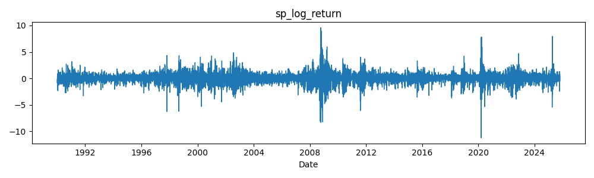
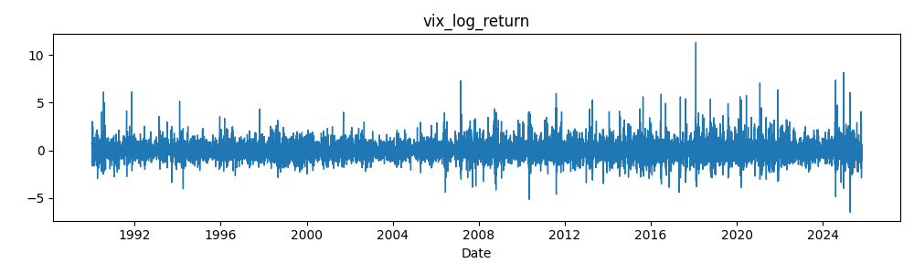
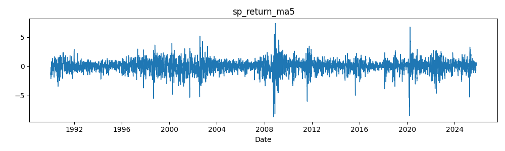
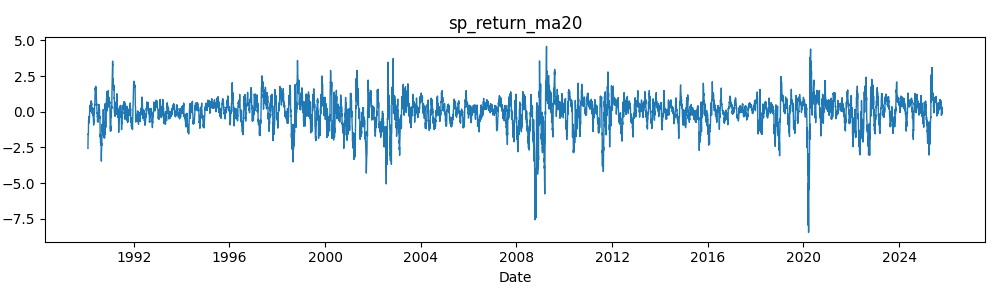
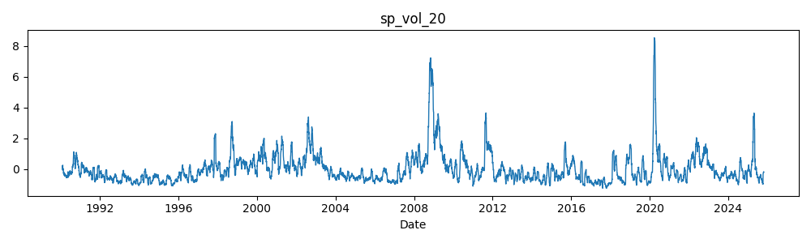
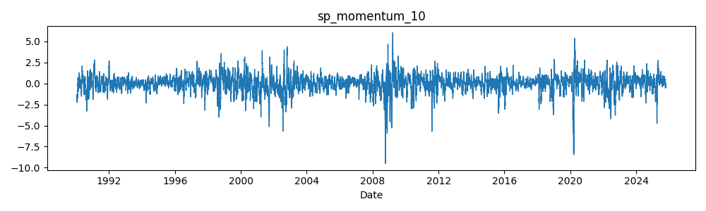

# Feature engineering — formulas and usage

This document explains the 10 time-series features computed by
`src/data/feature_engineering.py`, the parameter choices used in the
implementation, how missing values are handled, and where the generated
artifacts are saved in the repository.

Files produced by the pipeline (canonical paths)
- `data/processed/features_unnormalized.csv` — raw, un-normalized feature matrix (diagnostic)
- `data/processed/features_with_scaler.csv` — normalized feature matrix (canonical, 10 features)
- `data/processed/features_imputed.csv` — **modeling-ready CSV** (11 features, median-imputed, no NaNs)
- `data/processed/feature_scaler.json` — **portable normalization parameters** (recommended for sharing)
- `data/processed/imputer_medians.json` — median values used for imputation

**Note:** A local pickle `feature_scaler.pkl` may exist for convenience but is intentionally untracked. Prefer JSON for portability and security.

Which file should I use?
- **For modeling / HMM training:** Use `features_imputed.csv` (no NaNs, includes imputation masks)
- **To reproduce normalization:** Use `features_with_scaler.csv` + `feature_scaler.json`
- **For diagnostics / raw values:** Use `features_unnormalized.csv`

Overview
--------
The features are computed from the cleaned, merged S&P500 + VIX DataFrame
(`data/processed/sp500_vix_merged_clean.csv`). Where possible the pipeline
uses columns created by the cleaning step (for example, pre-computed
log-returns). All features are aligned by the `Date` index and returned as a
DataFrame with the same index.

Feature list and formulas
-------------------------
Below are the 10 features (column names are given in code-friendly form and
match the output of `compute_features()`):

1. sp_log_return
	 - Formula: sp_log_return_t = log(SP500_AdjClose_t) - log(SP500_AdjClose_{t-1})
	 - Implementation note: if the cleaned file already contains
		 `SP500_Adj Close_log_return` that column is used directly.

2. vix_log_return
	 - Formula: vix_log_return_t = log(VIX_AdjClose_t) - log(VIX_AdjClose_{t-1})
	 - Implementation note: uses `VIX_Adj Close_log_return` when present.

3. sp_return_ma5
	 - Formula: 5-day rolling mean of `sp_log_return`.
	 - Implementation: rolling(window=5).mean(), default min_periods is the
		 window length (so the first 4 rows are NaN).

4. sp_return_ma20
	 - Formula: 20-day rolling mean of `sp_log_return`.

5. sp_vol_20
	 - Formula: 20-day rolling sample standard deviation of `sp_log_return`.
	 - Implementation: rolling(window=20).std(). This is an empirical volatility
		 estimate over the lookback window.

6. sp_momentum_10
	 - Formula: 10-day cumulative log return = sum_{i=0..9} sp_log_return_{t-i}
	 - Implementation: rolling(window=10).sum(). Interpreted as a short-term
		 momentum signal.

7. sp_rsi_14
	 - Formula (Wilder-style approximation used):
		 - delta_t = sp_log_return_t
		 - gain_t = max(delta_t, 0), loss_t = max(-delta_t, 0)
		 - avg_gain = rolling_mean(gain, window=14)
		 - avg_loss = rolling_mean(loss, window=14)
		 - RS = avg_gain / avg_loss
		 - RSI = 100 - 100 / (1 + RS)
	 - Implementation note: the code uses a simple rolling mean to approximate
		 Wilder smoothing. The first ~13 values are NaN.

8. sp_atr_14
	 - Formula: Average True Range (14-day)
		 - TR_t = max(High_t - Low_t, |High_t - Close_{t-1}|, |Low_t - Close_{t-1}|)
		 - ATR_t = rolling_mean(TR, window=14)
	 - Implementation note: requires `SP500_High`, `SP500_Low`, and
		 `SP500_Close` to be present. If they are missing the column is NaN.

9. sp_volume_pct_change_1
	 - Formula: one-day percentage change in reported volume:
		 - sp_volume_pct_change_1_t = (Volume_t - Volume_{t-1}) / Volume_{t-1}
	 - Implementation note: computed via pandas .pct_change(); will be NaN for
		 the first row or when prior volume is zero or missing.

10. sp_high_low_range
		- Formula: (High_t - Low_t) / AdjClose_t
		- Implementation note: uses adjusted close in denominator to account for
			corporate actions (if available as `SP500_Adj Close`).

Handling of missing values
--------------------------
- Rolling features use pandas rolling with `min_periods` equal to the window
	size. This intentionally produces NaNs for the initial window where an
	estimate is not statistically meaningful.
- The pipeline does not impute these NaNs automatically. Downstream models
	should either handle NaNs (e.g. by masking) or apply an imputation step as
	appropriate for the model.

Normalization / reproducibility
--------------------------------
The pipeline supports two normalization methods in `normalize_features()`:

- **zscore (default):** (x - mean) / std — the pipeline computes column-wise
	mean and std and saves them to `data/processed/feature_scaler.json` as a
	portable JSON dict of the form:

	```json
	{
		"method": "zscore",
		"params": {
			"mean": {"sp_log_return": 0.000325, ...},
			"std": {"sp_log_return": 0.011402, ...}
		},
		"created_at": "2025-10-29T...",
		"versions": {"python": "3.11.5", "pandas": "2.3.3", "numpy": "2.3.4"},
		"features": ["sp_log_return", "vix_log_return", ...]
	}
	```

- **minmax:** scales to [0, 1] and the saved params are `min` and `max`.

**To reproduce normalization across environments:**
Load the JSON scaler and apply the transform manually or use the helper:

```python
import json
import pandas as pd

# Load JSON scaler (portable, safe)
with open('data/processed/feature_scaler.json', 'r') as f:
    scaler = json.load(f)

# Apply normalization manually
features_df = pd.read_csv('data/processed/features_unnormalized.csv', index_col=0, parse_dates=True)
if scaler['method'] == 'zscore':
    normalized = (features_df - pd.Series(scaler['params']['mean'])) / pd.Series(scaler['params']['std'])

# Or use the helper (loads JSON by default)
from src.data.feature_engineering import load_feature_scaler
scaler = load_feature_scaler()  # Prefers .json over .pkl
```

**Security warning:** Never load `feature_scaler.pkl` from untrusted sources — pickles can execute arbitrary code. The JSON scaler is safe and portable.

Quick usage examples
--------------------
In Python, from the project root:

```python
from src.data import feature_engineering as fe
import pandas as pd
import json

# Load modeling-ready features (imputed, no NaNs)
df_imputed = pd.read_csv('data/processed/features_imputed.csv', index_col=0, parse_dates=True)

# Load canonical normalized features (10 features, may have NaNs in early rows)
df_normalized = pd.read_csv('data/processed/features_with_scaler.csv', index_col=0, parse_dates=True)

# Load scaler from JSON (portable, recommended)
with open('data/processed/feature_scaler.json', 'r') as f:
    scaler = json.load(f)
print(f"Normalization method: {scaler['method']}")
print(f"Mean of sp_log_return: {scaler['params']['mean']['sp_log_return']:.6f}")

# Recompute features from raw merged data and re-normalize (if needed)
features = fe.compute_features(fe.load_merged())
normed, scaler_dict = fe.normalize_features(features, method="zscore")

# Create plots saved to docs/figures
fe.plot_features(normed, cols=normed.columns[:6], out_dir="docs/figures")

# Apply imputation (creates features_imputed.csv)
fe.prepare_features_for_modeling(impute=True, add_volume_log=True)
```

Notes and provenance
--------------------
- The features above are intentionally simple and commonly used in
	time-series momentum and volatility-based strategies.
- Window choices (5, 10, 14, 20) are conventional defaults; feel free to
	experiment by changing the window parameters in `compute_features()`.
- The canonical normalized CSV in the repository is
	`data/processed/features_with_scaler.csv`. The scaler required to reproduce
	normalization is `data/processed/feature_scaler.json`.
- For modeling, use `data/processed/features_imputed.csv` which includes:
	- All 10 original features plus `sp_volume_log_return` (11 total)
	- Median imputation for NaN values
	- Boolean `imputed_<col>` flags to track which values were imputed
	- Zero numeric NaNs (safe for HMM and neural network training)

Security & portability best practices
--------------------------------------
**Prefer JSON over pickle:**
- `feature_scaler.json` is a portable, human-readable format that works across Python versions and is safe to load from any source.
- `feature_scaler.pkl` exists locally for convenience but is **not tracked in git** and should never be loaded from untrusted sources (pickles can execute arbitrary code).

**Reproducibility:**
- The JSON scaler includes metadata: creation timestamp, Python/pandas/numpy versions, and the list of features.
- To share your work: commit the JSON files (`feature_scaler.json`, `imputer_medians.json`) and the CSV files.
- Never commit `.pkl` files to a shared repository.


Figures
-------
Below are example feature visualizations produced by the pipeline. The
images are stored in `docs/figures` (relative to this document). Each figure
is a single-series line plot of the normalized feature over the full time
range.

<figure>
	
	<figcaption>Figure 1 — SP500 log return (normalized)</figcaption>
</figure>

<figure>
	
	<figcaption>Figure 2 — VIX log return (normalized)</figcaption>
</figure>

<figure>
	
	<figcaption>Figure 3 — SP500 5-day rolling mean of log returns (sp_return_ma5)</figcaption>
</figure>

<figure>
	
	<figcaption>Figure 4 — SP500 20-day rolling mean of log returns (sp_return_ma20)</figcaption>
</figure>

<figure>
	
	<figcaption>Figure 5 — SP500 20-day rolling volatility (sp_vol_20)</figcaption>
</figure>

<figure>
	
	<figcaption>Figure 6 — SP500 10-day momentum (sp_momentum_10)</figcaption>
</figure>

